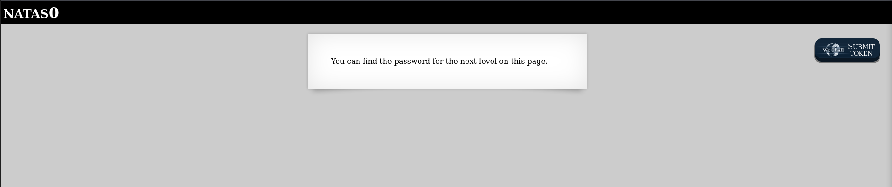
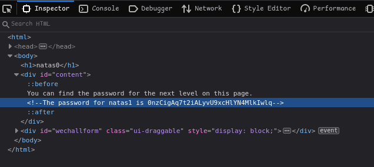

# Natas0
When we log into the given url http://natas0.natas.labs.overthewire.org with the given username and password, 
we see a page with a box saying "You can find the password for the next level on this page"

First thing to do is open Developer Tools with F12 and check for any obvious signs

As we can see in the html code, the password for natas1 is 0nzCigAq7t2iALyvU9xcHlYN4MlkIwlq 
